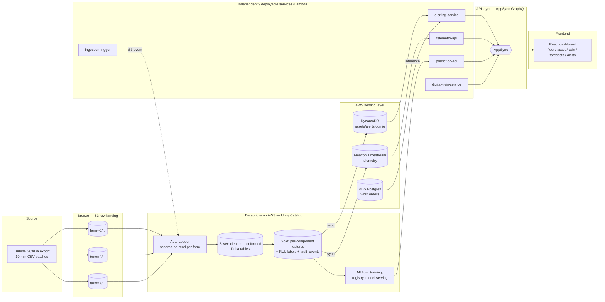

# Wind Turbine Predictive Maintenance Platform — Architecture Blueprint

**Status:** Draft v1 — architecture blueprint + repo scaffold (not yet deployed)
**Cloud:** AWS
**Compute/analytics:** Databricks on AWS (medallion architecture, Unity Catalog)
**Scope:** Wind Farms A, B, C (all three) · Predictive maintenance for Gearbox, Hydraulics, Pitch System, Generator, Transformer, Rotor Brake, Bearing (vibration analysis)
**Related:** [ADR-0001](../adr/0001-cloud-and-iac-choice.md) · [ADR-0002](../adr/0002-serving-store-choice.md) · [ADR-0003](../adr/0003-digital-twin-scope.md) · [Manual setup runbook](../manual-setup/RUNBOOK.md)

---

## 1. Problem & Goals

The source data is the public wind-turbine SCADA benchmark: 95 ten-minute-resolution time series across 36 turbines in three farms (A: onshore Portugal/EDP, B & C: offshore Germany, anonymized), 44 of which contain a labeled anomaly event and 51 normal behavior. Farm C is by far the richest: 957 sensor columns per file including full pitch, hydraulic, and water-cooling instrumentation.

Goals for the platform:

1. **See it coming, not just detect it** — classify *which* component is degrading (Gearbox / Hydraulics / Pitch System / Generator / Transformer / Rotor Brake / Bearing, extensible to others) and forecast *how long until it fails* (RUL), not just flag anomalies after the fact.
2. **One ingestion path, many consumers** — a medallion pipeline that turns raw per-turbine SCADA dumps into trustworthy, feature-ready tables usable by both ML training and live dashboarding.
3. **No single deployable "does everything"** — backend capability is split into independently deployable services; a change to alerting logic never requires redeploying the telemetry API.
4. **Operable across environments** — dev → staging → uat promotion, each isolated, each reproducible from code.
5. **Explainable, not just accurate** — every prediction the dashboard shows must be traceable back to the sensor evidence a maintenance engineer can sanity-check (see the EDA degradation-trend charts in `eda/EDA_REPORT.md` for the kind of evidence this means).

## 2. High-Level Architecture

## 3. Medallion Data Architecture

| Layer | Storage | Contents | Key transforms |
|---|---|---|---|
| **Bronze** | S3, prefix `s3://<env>-wtb-bronze/farm=A\|B\|C/turbine=<asset_id>/` | Raw CSVs as landed, byte-for-byte | None — append-only, immutable |
| **Silver** | Delta tables in Unity Catalog, `silver.farm_a`, `silver.farm_b`, `silver.farm_c` (kept as separate table families — 86/257/957 columns are not force-unified into one schema) | Timestamp normalized to UTC, `status_type_id` validated against the 0–5 domain, dedup on `(asset_id, time_stamp)`, joined against `event_info` to tag each row with `event_id`/`event_label` where applicable | Databricks Auto Loader + a scheduled MERGE job |
| **Gold** | Delta tables `gold.gearbox_features`, `gold.hydraulics_features`, `gold.pitch_features`, `gold.generator_features`, `gold.transformer_features`, `gold.rotor_brake_features`, `gold.vibration_features`, `gold.fault_events`, `gold.rul_labels` | Rolling-window aggregates (1h/6h/24h) per component's sensor group, a component health index, `fault_events` fact table (one row per labeled event with category + severity), RUL labels = hours from each pre-event row back to `event_start` | Feature engineering notebooks, one per component category |

**Why per-farm table families instead of one unified schema:** Farm A (86 cols), B (257 cols), C (957 cols) have almost no column-name overlap beyond the 5 metadata columns and B/C's sensors are anonymized (`sensor_N`) — forcing a single wide schema would mean either massive sparsity or losing farm-specific sensors. Gold-layer feature tables are where cross-farm comparability actually happens, because features are defined semantically ("gearbox oil temperature trend", "pitch axis deviation") rather than by raw column name, using the per-farm `feature_description.csv` mapping as the join key during feature engineering.

**Unity Catalog layout:** one catalog per environment (`dev`, `staging`, `uat`), each with `bronze`/`silver`/`gold` schemas and external locations pointing at that environment's S3 buckets. See `infra/terraform/modules/databricks-unity`.

**Orchestration:** Databricks Workflows (`data-platform/resources/jobs.yml`), triggered on a schedule for batch reprocessing and additionally via `ingestion-trigger` (Lambda on S3 `ObjectCreated`) for near-real-time landing of new files.

## 4. Machine Learning

Three problem types, scoped to Gearbox / Hydraulics / Pitch System / Generator / Transformer / Rotor Brake / Bearing (extensible to Yaw, Converter, PLC/communications once proven — see [the anomaly detection guide](ANOMALY_DETECTION_GUIDE.md) for why each was prioritized and how detection works per component, including Bearing's vibration-analysis approach):

| Problem | Approach | Notebook | Notes |
|---|---|---|---|
| **Fault classification** | Gradient-boosted trees (LightGBM/XGBoost) per component category, multi-class output (`normal` / `degrading` / `<component>_fault`), features from `gold.<component>_features` | `data-platform/ml/04_train_fault_classifier.py` | Trained per farm-family first (schemas differ), evaluated jointly |
| **RUL (Remaining Useful Life)** | Regression to hours-until-failure using `gold.rul_labels`, quantile loss (P10/P50/P90) for uncertainty bands rather than a single point estimate | `data-platform/ml/05_train_rul_regressor.py` | Point estimates without bounds are misleading for maintenance scheduling — the dashboard always shows the band |
| **Trend forecasting** | Component health-index forecasting; start with classical methods (Prophet / exponential smoothing) for interpretability and small-data robustness; note Temporal Fusion Transformer / LSTM as a v2 upgrade once enough labeled history accumulates | `data-platform/ml/06_train_trend_forecaster.py` | Classical-first is deliberate — 44 labeled events total across all farms is not enough to trust a deep model's extrapolation yet |

**Vibration analysis (Bearing) is a distinct signal type, called out separately:** Farm B (drive-train/tower vibration) and Farm C (nacelle vibration) both carry real broadband vibration sensors (10-minute avg/max/min/std of overall amplitude, in mG or m/s²) — this is genuinely different from every other component above, which are all temperature/pressure-based. `gold.vibration_features` and the `vibration` component parameter flow through the exact same classification/RUL/forecasting pipeline as the other six, but the input signal's physical meaning is different enough that it gets its own subsection in the anomaly detection guide, including an important scope caveat: this dataset provides broadband severity statistics, not raw high-frequency waveform/FFT spectra, so it supports "is vibration trending up" detection, not frequency-domain fault-type diagnosis (distinguishing a bearing inner-race defect from a gear-mesh issue, for example) — that would need real accelerometer waveform capture, a documented v2 hardware/data extension, not something this dataset contains.

**Tracking & registry:** MLflow (built into Databricks) for experiment tracking and the model registry, promoted `dev → staging → uat` by registry stage transition gated in CI (see §7).

**Serving:** Databricks Model Serving (real-time REST) is the default — it keeps training and serving on one platform and avoids standing up a second inference stack. SageMaker endpoints are a documented alternative (see ADR-0002) if the org wants inference fully decoupled from Databricks compute/billing.

## 5. Backend — Independently Deployable Services (no monolith)

Each service below is its own deployable unit (own Lambda function(s), own IAM role, own Terraform module instance) — none share a runtime process, and none can only be deployed together. They are unified for consumers through a single **AppSync GraphQL API**, which is not a monolith itself — it's a managed API gateway with per-field resolvers, so adding a field for a new service doesn't require touching another service's code.

| Service | Responsibility | Backing store | Trigger |
|---|---|---|---|
| `telemetry-api` | Serve current + historical turbine sensor readings | Amazon Timestream | AppSync resolver (query) |
| `prediction-api` | Serve fault probability, RUL bands, forecast series | Databricks Model Serving (proxied) | AppSync resolver (query) |
| `alerting-service` | Evaluate thresholds/model outputs, raise alerts, notify | DynamoDB (alert state) + RDS (work orders) | EventBridge rule on new Gold data / prediction |
| `digital-twin-service` | Publish near-real-time per-turbine state for the 3D view | Timestream + DynamoDB | AppSync subscription publisher |
| `ingestion-trigger` | Kick off Databricks ingestion job when new raw files land | — | S3 `ObjectCreated` event |

**Why AppSync over a hand-rolled BFF:** the dashboard genuinely needs one coherent contract (a "no monolith" backend still needs *a* front door), and AppSync gives that plus native GraphQL subscriptions — which the digital twin needs for live updates — without writing and operating a bespoke aggregation service that would itself become the de facto monolith.

**Serving stores** (see ADR-0002 for the reasoning):
- **Amazon Timestream** — time-series sensor data synced from `gold.*_features`, optimized for the read pattern the dashboard actually has (latest value + recent window per turbine).
- **DynamoDB** — asset registry, alert state, dashboard config — low-latency key-value, schema flexible.
- **RDS Postgres** — maintenance/work-order records — genuinely relational (assets ↔ work orders ↔ technicians ↔ parts), doesn't fit key-value well.

## 6. React Dashboard

Single modular SPA (Vite + TypeScript), not literal micro-frontends — the "no monolith" requirement is about backend deployability, not frontend fragmentation; splitting the frontend into separately-deployed micro-frontends would add real operational cost (routing/shell coordination, versioning, shared-dependency drift) without a corresponding benefit at this scale. If the team scales to multiple independent frontend squads later, Module Federation is a clean migration path from this structure since modules are already domain-isolated folders.

Modules:
- **Fleet Overview** — cross-farm KPI tiles + fault-category breakdown (grounded directly in `eda/outputs/fleet_summary.json`)
- **Asset Detail** — per-turbine/per-component sensor trends, current health index
- **Digital Twin** — 3D visualization (react-three-fiber), live-bound to `digital-twin-service` subscriptions (see ADR-0003 for scope)
- **Forecasts & RUL** — forecast series with confidence bands, RUL estimate with P10/P50/P90
- **Alerts** — active/historical alerts, acknowledgement workflow

## 7. Environments, IaC & CI/CD

**Environments:** `dev`, `staging`, `uat` — each with its own AWS account (recommended) or, as a documented fallback, its own resource-name-prefixed namespace in a single account (see ADR-0001). Each has its own Unity Catalog catalog, S3 buckets, Terraform state file, and GitHub Environment (for deployment approval gates).

**IaC:** Terraform is the primary path (`infra/terraform/`) — reusable modules composed per environment in `infra/terraform/envs/<env>/`. A parallel manual AWS-console + Databricks-UI runbook (`docs/manual-setup/RUNBOOK.md`) covers the same resources for teams not ready for Terraform, and for the one-time account-level bootstrapping (AWS Organizations, IAM Identity Center/SSO) that's typically done by hand regardless.

**CI/CD (GitHub Actions):** trunk-based. Merges to `main` auto-deploy to `dev`. Promotion to `staging` and `uat` requires a GitHub Environment manual-approval gate. Four workflow families: `terraform-plan`/`terraform-apply` (per env), `databricks-bundle-deploy` (data-platform notebooks/jobs via Databricks Asset Bundles), `backend-deploy` (per-service Lambda package + Terraform apply of that service's module instance), `frontend-deploy` (build + S3 sync + CloudFront invalidation).

## 8. What's Deliberately Out of Scope (v1)

- Real-time streaming ingestion (Kinesis) — the source data arrives as batch file drops; Auto Loader on S3 covers this. Documented as a straightforward v2 addition if a live SCADA feed becomes available.
- Multi-account AWS Organizations setup automation — Terraform assumes accounts already exist; account creation itself is a manual, rarely-repeated bootstrap step (see RUNBOOK.md).
- Deep-learning forecasting models — classical methods first, given the limited labeled-event count (see §4).
- A physics-based digital twin simulation — see ADR-0003.
