# Wind Turbine SCADA - Exploratory Data Analysis

Scope: Wind Farm A (onshore Portugal, EDP), Wind Farm B and Wind Farm C (offshore Germany).
Every number below was computed by the scripts in `eda/scripts/` against the real CSVs in
`wind-turbine-scada-data-for-early-fault-detection/` (sibling to this repo) - nothing here
is illustrative or invented. Re-run any script to reproduce a number:

```
python eda/scripts/01_data_quality.py
python eda/scripts/02_event_analysis.py
python eda/scripts/03_sensor_profiling.py
python eda/scripts/04_degradation_trends.py
python eda/scripts/05_fleet_summary.py
```

Full machine-readable outputs: `outputs/data_quality.json`, `outputs/events_categorized.csv`,
`outputs/fleet_summary.json`.

---

## 1. Data quality summary

| Farm | Event files | Distinct turbines (asset_id) | Columns | Total rows | Read time |
|---|---|---|---|---|---|
| A | 22 | **5** | 86 | 1,196,747 | 3.1s |
| B | 15 | **9** | 257 | 859,065 | 6.6s |
| C | 58 | **22** | 957 | 3,187,136 | 171.5s |

**Finding: file count is not turbine count.** Each CSV in `datasets/` is one *event window* for
one turbine (its filename is `comma_<event_id>.csv`), and turbines recur across several event
windows. The real fleet is much smaller than the file counts suggest: 5 turbines (A), 9 (B), 22
(C) - 36 physical turbines total across the three farms, computed from distinct `asset_id`
values. This matters for the platform's data model: "turbine" and "event window" are different
entities and both need their own key.

**Missingness.** Across all three farms, schema is 100% consistent across every file in a farm
(no ragged columns), and there are **zero columns with more than 5% missing data** in any farm:

- Farm A: 84/86 columns always populated (0% missing); the other 2 (`sensor_14_avg`,
  `sensor_22_avg`) are missing in only 0.0017% of rows.
- Farm B: 255/257 columns always populated; the 2 remaining (`power_62_max`, `power_62_std`)
  are missing in at most 0.0093% of rows.
- Farm C: 121/957 columns always populated, and the other 836 (mostly `_max`/`_min`/`_std`
  variants) are "mostly populated" by our bucketing rule - but the actual missing rate across
  every one of those 836 columns tops out at **0.0136%**. In practice Farm C's SCADA export is
  essentially complete; the large "mostly populated" bucket count is an artifact of the 5%
  threshold catching sub-0.02% gaps, not a real quality problem.
- No farm has any column in the "sparse" (>5% missing) bucket.
- Metadata dtypes (`time_stamp`, `asset_id`, `id`, `train_test`, `status_type_id`) are sane and
  consistent in all three farms; zero cross-file dtype mismatches were found anywhere.

**`status_type_id` distribution** (fleet operating-state mix, all rows):

| Farm | normal (0) | derated (1) | idling (2) | service (3) | downtime (4) | other (5) |
|---|---|---|---|---|---|---|
| A | 75.09% | - | - | 1.98% | 1.17% | 21.76% |
| B | 89.84% | 5.51% | - | - | 0.42% | 4.22% |
| C | 89.22% | - | - | 7.74% | 0.63% | 2.41% |

**Finding: status codes are not used consistently across farms.** Farm A and Farm C never emit
`status_type_id` 1 (derated) or 2 (idling-normal) at all - their operational states are only
0/3/4/5. Only Farm B records a derated state, and even there it never records idling(2). This
directly limited the "lead time from derated/idle onset to downtime" KPI (see Section 5 and
`fleet_summary.json`): it was only computable for 2 of 44 anomaly events fleet-wide (both in
Farm B, average 1.2 hours) - too small a sample to generalize, so the platform should not treat
it as a reliable global number without more instrumentation-consistent data.

**`train_test` split**: all three farms reserve a small "prediction" slice per event file (A:
4.23%, B: 8.40%, C: 4.97% of rows) - this is the dataset's own designated lead-up-to-and-through
-the-event window, which script 04 uses directly for the degradation-trend charts.

---

## 2. Fault taxonomy findings

Every anomaly event's free-text `event_description` was keyword-matched into one component
category (see `eda/scripts/02_event_analysis.py` for the exact keyword lists and priority
order). Full categorized table: `outputs/events_categorized.csv`.

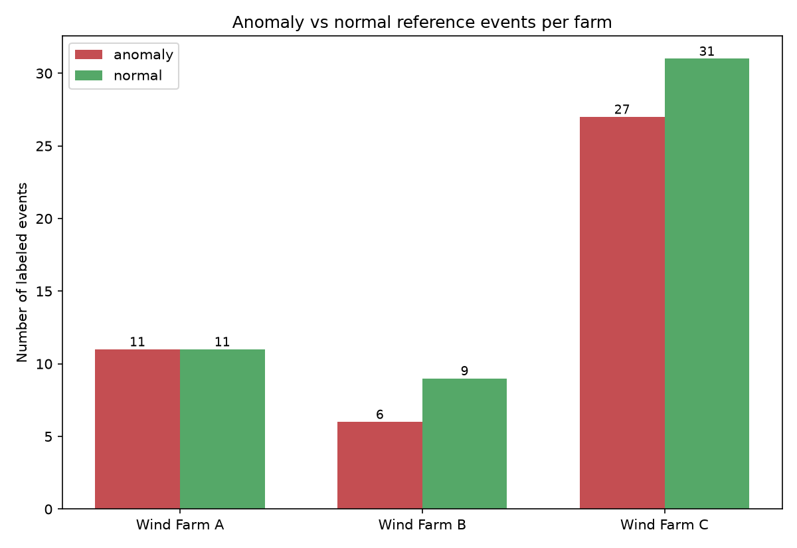

Farm A: 11 anomaly / 11 normal reference events. Farm B: 6 anomaly / 9 normal. Farm C: 27
anomaly / 31 normal - consistent with Farm C being both the largest and most heavily
instrumented farm.

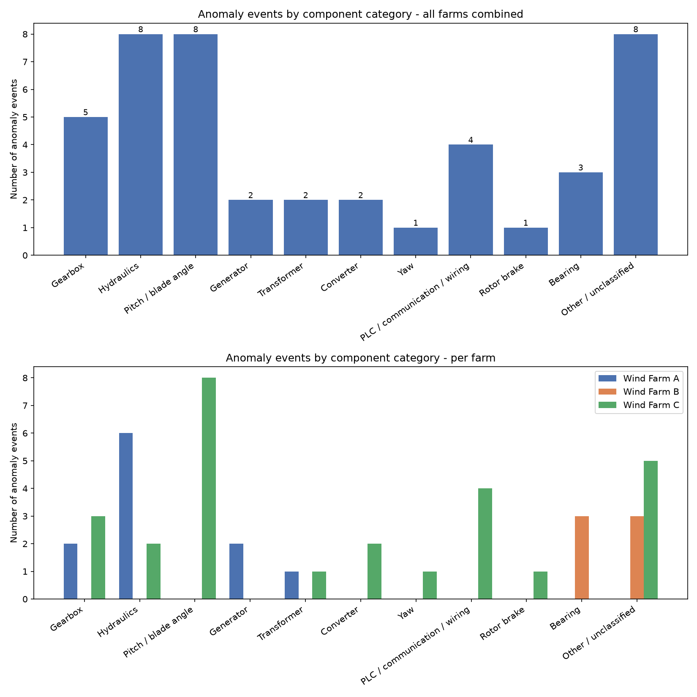

Fleet-wide anomaly counts by category (44 anomaly events total):

| Category | Count |
|---|---|
| Hydraulics | 8 |
| Pitch / blade angle | 8 |
| Other / unclassified | 8 |
| Gearbox | 5 |
| PLC / communication / wiring | 4 |
| Bearing | 3 |
| Transformer | 2 |
| Generator | 2 |
| Converter | 2 |
| Rotor brake | 1 |
| Yaw | 1 |

Hydraulics, Pitch, and Other are tied at 8 events each - there is no single dominant category
fleet-wide.

**Farm A** matches its documented known-fault taxonomy exactly: Hydraulics (6, all literally
labeled "Hydraulic group"), Gearbox (2, "Gearbox failure"), Generator (2, "Generator bearing
failure"), Transformer (1, "Transformer failure"). No pitch-system anomaly events exist for Farm
A at all - consistent with Farm A's known-fault list (transformer/hydraulic/gearbox only).

**Farm C** is dominated by **Pitch / blade angle** (8 events) - matching the task brief's
expectation that pitch is a dominant real fault category for this farm's 3-axis independent
pitch control design - followed by PLC/communication (4: Beckhoff-card/NC300/NC310/wiring
faults) and Gearbox (3). Real event text is rich and specific, e.g. event 12 ("Oil level error,
two-pump mode + Oil Leakage Gear Oil Supply + Rotor brake B cannot be closed..."), event 66
("Pitchfailure - defect Beckhoffcard, Axis 2..."), event 44 ("Valve in water cooling system was
left in wrong position after maintenance").

**Farm B splits cleanly into two real issue modes.** Half of its 6 anomaly events ("Rotor Bearing 2
- Damage", "Turbine is stopped due to a main bearing damage", "standstill...due to rotorbearing
damage") are genuine main/rotor bearing failures - now captured by a **Bearing** category added
specifically because Farm B carries real vibration sensors (drive-train and tower accelerometers,
see Section 3) that let this taxonomy extend to cover them. The remaining 3 ("high temperature" x3)
stay in "Other/unclassified" - generic alarms with no component-specific keyword to match, a real
finding about this farm's maintenance-log detail level, not a taxonomy gap.

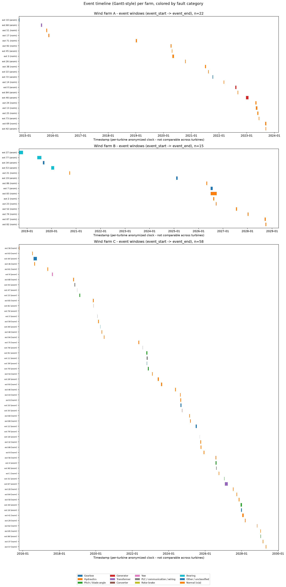

The timeline chart also surfaces an important caveat: **event dates are not real calendar time.**
This benchmark anonymizes each turbine's clock independently (years visibly range ~2014-2029
across files), so `event_start`/`event_end` cannot be compared across turbines or used to infer
fleet-wide seasonality - only within-turbine order and event *duration* are meaningful.

---

## 3. Sensor profiling takeaways

For each farm, representative `_avg` sensors for Gearbox/Hydraulics/Pitch/Generator/Transformer/
Rotor brake/Vibration (Bearing) were selected by matching keywords against
`comma_feature_description.csv`'s `description` column (not the anonymized `sensor_name` itself -
see caveats). Distributions:
[Farm A](outputs/charts/sensor_distributions_farmA.png) |
[Farm B](outputs/charts/sensor_distributions_farmB.png) |
[Farm C](outputs/charts/sensor_distributions_farmC.png).
Correlations:
[Farm A](outputs/charts/sensor_correlation_farmA.png) |
[Farm B](outputs/charts/sensor_correlation_farmB.png) |
[Farm C](outputs/charts/sensor_correlation_farmC.png).

- **Farm A's feature descriptions are the most explicit of the three farms** - e.g. "Temperature
  oil in gearbox", "Temperature in generator bearing 2 (Drive End)", "Temperature oil in
  hydraulic group" - so category-to-sensor mapping was unambiguous. Gearbox oil/bearing
  temperatures both show a right-skewed 15-70°C distribution typical of load-dependent heating;
  hydraulic oil temperature is bimodal (~28-32°C and ~48-52°C clusters), plausibly two distinct
  operating regimes (e.g. pump duty cycle on/off).
- **Farm B has no sensor at all whose description mentions "hydraulic"** - its 257-column
  feature list documents gearbox bearing/oil temps, pitch axis motor temps/currents, and
  generator bearing/slip-ring temps in detail, but hydraulics is simply not an instrumented
  subsystem in this farm's SCADA export. That is a genuine platform-scope constraint, not a
  matching failure - confirmed by manual inspection of all 64 rows of Farm B's feature
  description file.
- **Farm C has the richest instrumentation** of the three: 3 independent gearbox-oil-pressure/
  temperature sensors, 2 hydraulic-oil-tank temperature sensors (which correlate at r=0.75 -
  likely a redundant sensor pair rather than two independent readings), and per-axis
  (1/2/3) pitch motor temperatures reflecting its 3-axis independent pitch control design.
  Generator cooling-air-inlet temperatures 1 and 2 are highly correlated (r=0.90), again
  suggesting paired/redundant instrumentation rather than independent signals.
- **Transformer instrumentation exists in all three farms** with genuinely descriptive text -
  Farm A: "Temperature in HV transformer phase L1/L2/L3"; Farm B: "Transformer L1 (mid-voltage)
  temperature", "Temperature internal consumption transformer"; Farm C: "Oil temperature EB
  transformer", "Oil temperature 1/2 main transformer" - per-phase and per-unit granularity
  differs by farm, so a shared "transformer health" feature has to be built per-farm from
  whichever phases/units that farm actually instruments, not assumed identical across farms.
- **Rotor brake instrumentation is real but rare**: only Farm C has a directly-named rotor-brake
  sensor pair (`sensor_54`/`sensor_55`, "Hydraulic pressure rotor brake B/A"). Farm A and Farm B's
  feature descriptions contain no rotor-brake-specific sensor at all under either the narrow
  ("rotor brake") or broad ("brake") keyword match - confirmed by manual inspection, not a
  matching failure. This means rotor-brake feature engineering and model training are Farm-C-only
  for now; extending it to A/B would need new instrumentation, not just a new keyword.
- **Vibration is real, but only on Farm B and C, and it's a different physical signal entirely**:
  Farm B has 3 accelerometers ("Drive train vibration axis Z", "Tower vibration axis X/Y", in mG);
  Farm C has 4 ("Nacelle vibration longitudinal 1/2", "Nacelle vibration transverse 1/2", in
  m/s²). Farm A has none. Critically, every one of these is a **10-minute statistical aggregate**
  (avg/max/min/std of overall vibration amplitude) - not a raw high-frequency waveform. That
  supports broadband "is vibration trending worse" monitoring, not frequency-domain diagnosis of
  which specific bearing/gear fault mode is present (see Section 4 and the anomaly detection
  guide for what this does and doesn't let the platform claim).

---

## 4. Degradation-trend charts (the early-fault-detection evidence)

Method: for each farm, for each of Gearbox/Hydraulics/Pitch/Generator/Transformer/Rotor
brake/Bearing where a real anomaly event in that category exists, the representative sensor(s) are
plotted across the dataset's own `train_test == 'prediction'` window (its designated
lead-up-through-fault window) on a time axis relative to `event_start`, overlaid against the farm's
longest-available normal-event baseline on the same relative axis. Selection is rule-based (longest
available `prediction` window per category), not hand-picked. Farm B contributes only the Bearing
chart below (its 3 real bearing-damage events are the only ones in this taxonomy it has) - its
remaining 3 anomalies are generic high-temperature reports that still match no category.

### Farm A - Gearbox (event 72, "Gearbox failure")
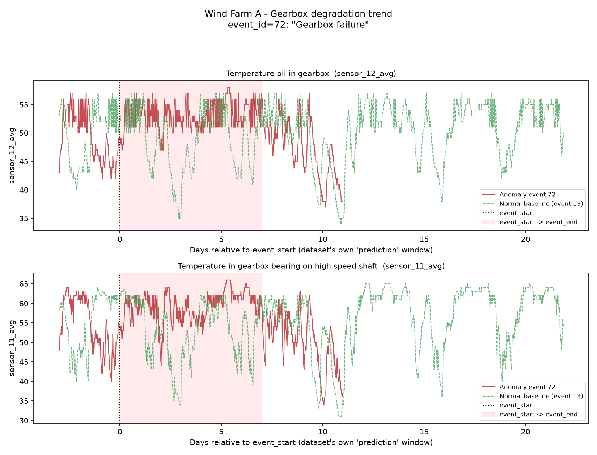
Gearbox oil temperature and high-speed-shaft bearing temperature both run visibly hotter and
noisier than the normal baseline through most of the pre-fault window, with a sharp shared dip
starting ~day 9-11 (both sensors drop together, consistent with a derate/shutdown rather than
independent sensor noise) before the file ends. The two sensors moving together supports using
them as a joint early-warning pair rather than either alone.

### Farm A - Hydraulics (event 73, "Hydraulic group")
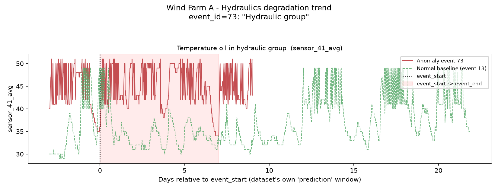
This is the cleanest signal in the whole EDA: hydraulic-group oil temperature sits persistently
~10-15°C above the normal baseline for the *entire* pre-fault window shown (days -3 to +9), not
just near `event_start`. That is a strong, sustained offset rather than a last-minute spike -
exactly the kind of early, stable signature a lead-time detector could exploit.

### Farm C - Gearbox (event 12, "Oil level error, two-pump mode + Oil Leakage Gear Oil Supply...")
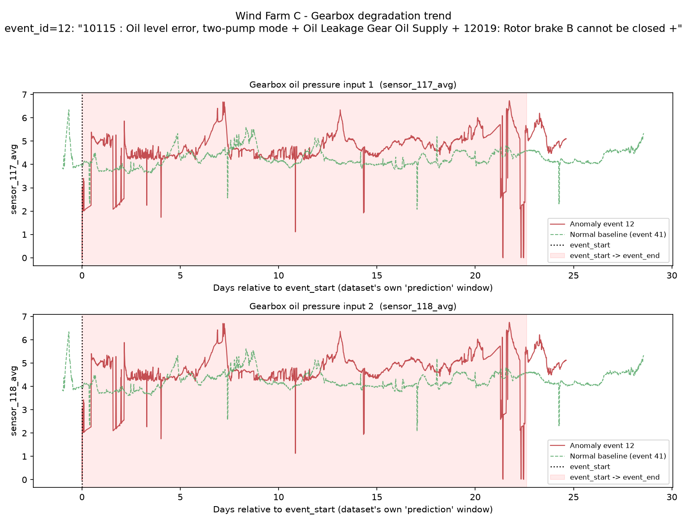
Gearbox oil pressure (both input sensors, which move identically) runs at a visibly higher and
much more erratic level (~5 bar with frequent sharp drop-outs to near 0) than the ~4 bar, low-
noise normal baseline, across the entire ~30-day window - consistent with the "two-pump mode" /
"oil leakage" wording in the real event description.

### Farm C - Hydraulics (event 28, "P20_spinner_carbonbrush defekt + P20_Accumulators_hydraulic system")
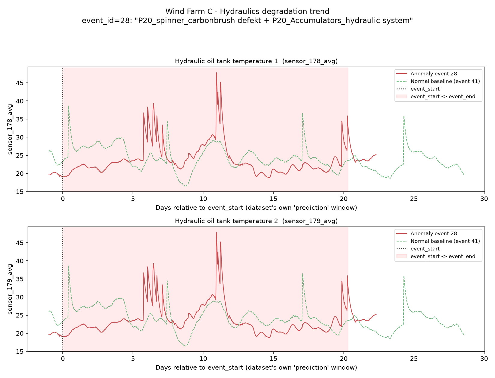
Hydraulic oil tank temperature shows several sharp multi-day spikes (up to ~45-48°C vs a ~20-30°C
baseline band) recurring throughout the window rather than one single event, which is consistent
with a described accumulator/hydraulic-system fault that recurs under load rather than a single
one-off failure.

### Farm C - Pitch / blade angle (event 91, "23020 : Axis 3 not ready-to-operate")
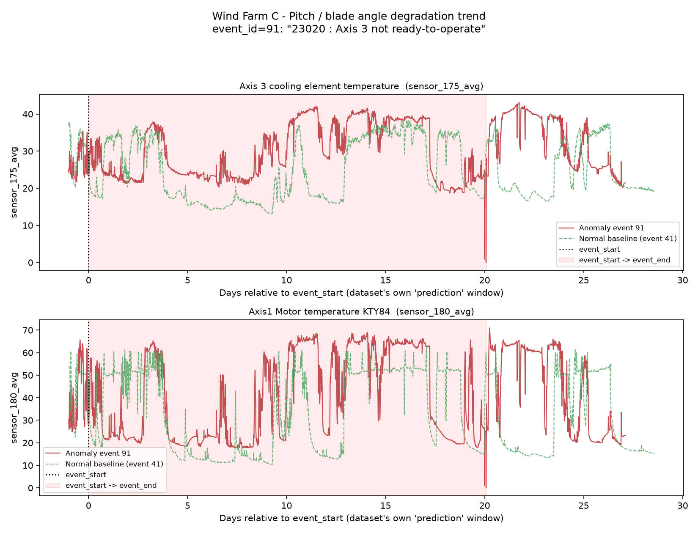
The rule-based sensor pick happened to align with the fault text itself: Axis 3 cooling-element
temperature (the axis literally named in the real event description) runs consistently ~5-10°C
above the normal baseline for most of the pre-fault window, and Axis 1 motor temperature shows a
similar sustained elevation - both pointing to a genuine multi-day thermal precursor rather than
an instantaneous trip.

### Farm A - Generator (event 40, "Generator bearing failure")
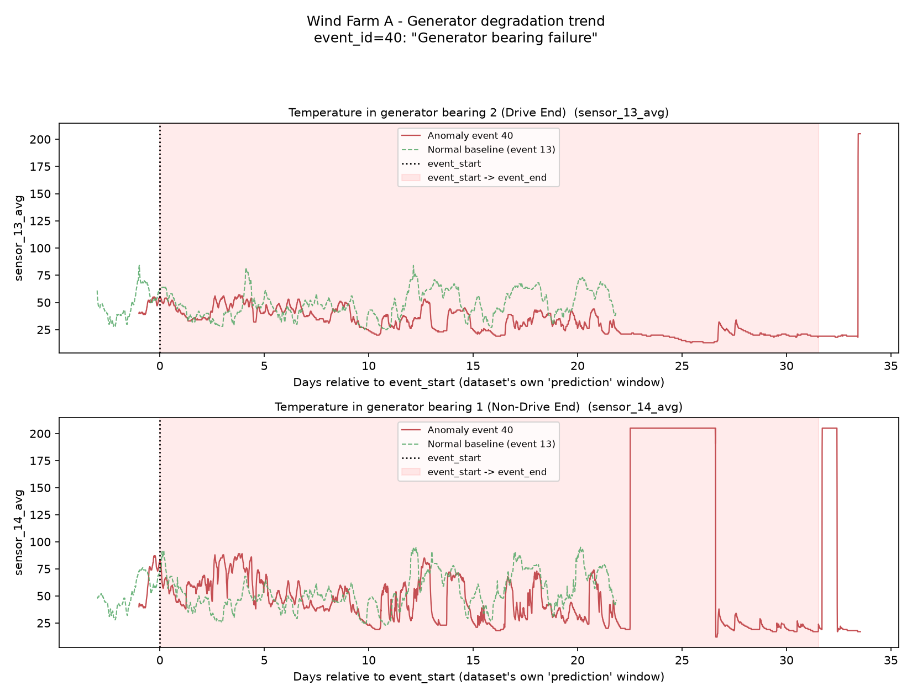
Counter-intuitively, both bearing-temperature sensors (Drive End, Non-Drive End) run *cooler and
less variable* than the normal baseline through most of the pre-fault window - the opposite
direction from every other degradation chart in this report. Read together with the fault
category, this is more consistent with the turbine already being throttled back (derated/reduced
load) in response to an early bearing symptom than with unchecked overheating. Non-Drive-End
temperature (`sensor_14_avg`) also shows two flat plateaus pinned at exactly ~204 late in the
window - almost certainly a sensor fault/dropout code rather than a real physical reading (a real
bearing cannot jump to and hold a constant value that precisely). **This is flagged as a data
quality issue for the classifier/RUL pipeline to filter, not treated as signal.**

### Farm A - Transformer (event 68, "Transformer failure")
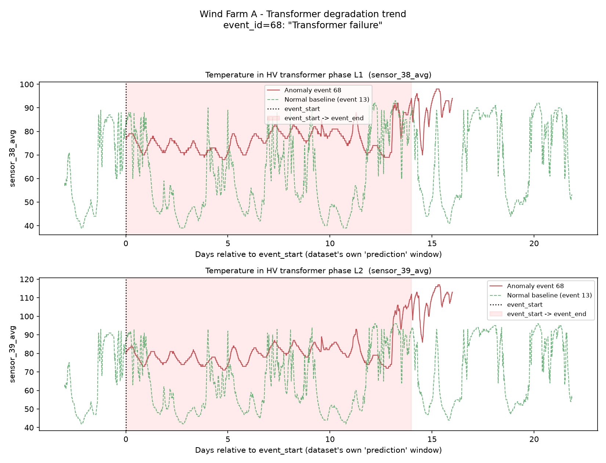
During the officially-logged event window (days 0-14) both HV transformer phase temperatures
actually show *reduced* day/night thermal cycling compared to the baseline's wide swings -
suggestive of the unit running under an abnormally steady, elevated load rather than its normal
cyclic profile. The clearer signal is what happens right after the logged window ends: phase L2
temperature (`sensor_39_avg`) climbs from a baseline-comparable ~80-95°C up to 110-117°C over the
following week - a real post-window thermal-runaway trend visible in the data even though it falls
outside the dataset's own labeled fault span.

### Farm C - Transformer (event 67, "overpressure on the main transformer")
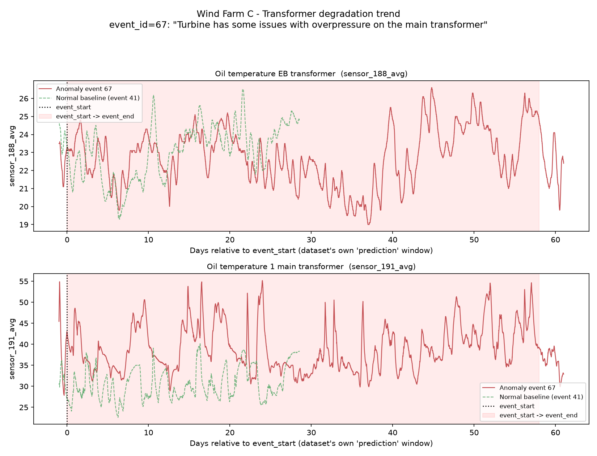
Of the two transformer-oil sensors profiled, only one is discriminative: "Oil temperature 1 main
transformer" (`sensor_191_avg`) runs a clean, sustained ~10-15°C above the normal baseline for
essentially the entire ~58-day window - one of the longest, cleanest early-warning offsets in this
whole report. "Oil temperature EB transformer" (`sensor_188_avg`), a different transformer bank,
tracks the baseline closely and is not useful for this event. **Reported honestly**: the
rule-based sensor pick surfaces both, but only the first is actually informative - a real
production feature set would down-weight or drop the second for this fault type.

### Farm C - Rotor brake (event 18, "24VAC supply fault to rotor brake, then extended standstill")
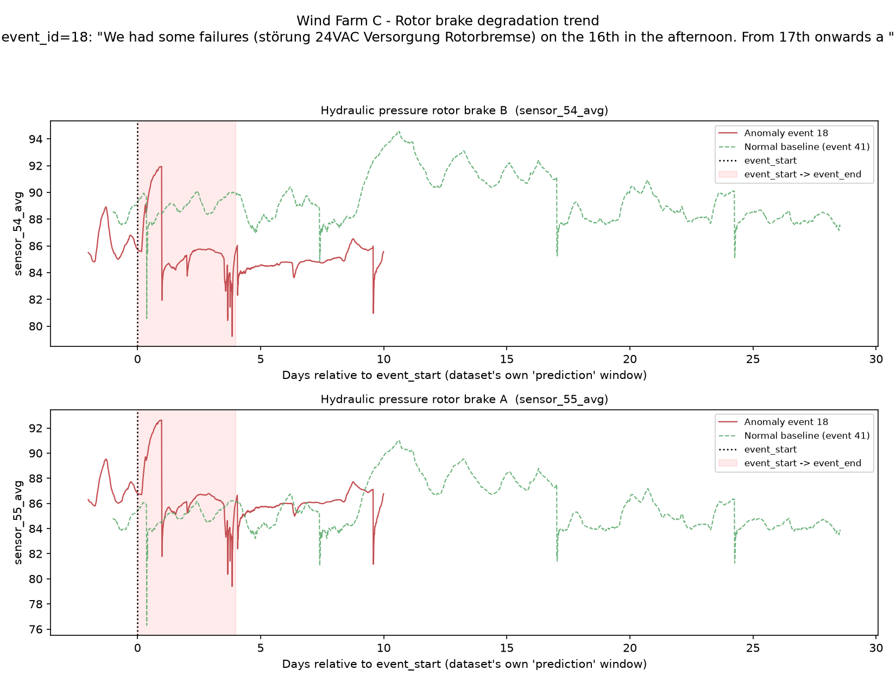
Both rotor-brake hydraulic-pressure sensors (caliper A and B) run persistently *lower* than the
normal baseline across the ~10 days of available pre-fault data, with several sharp transient
dips overlaid on top of that lower baseline - consistent with a control/power-supply fault (24VAC
supply to the brake) causing degraded, erratic pressure regulation rather than a single
instantaneous mechanical break. Note this anomaly event's own `prediction` window is much shorter
(~10 days) than the normal baseline's (~28 days), so the comparison window is asymmetric - a real
early-warning system would need pre-fault data further back than this dataset happens to provide
for this specific event.

### Farm B - Bearing / Vibration (event 27, "Turbine is stopped due to a main bearing damage")
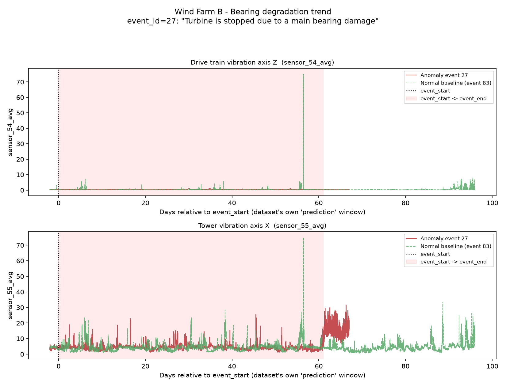
This is the only event in the dataset with both real bearing-fault text *and* real vibration
instrumentation, and it's an honest mixed result rather than a clean win. Drive-train vibration
(axis Z) shows no usable separation from baseline through the pre-fault window - both series sit
near zero with occasional matching transient spikes. Tower vibration (axis X) also overlaps the
baseline's noisy range closely during the ~61-day labeled event window itself - no early
separation there either. The clear signal instead appears in the roughly one-week span
*immediately after* the labeled event window closes, where the anomaly turbine shows a sustained,
densely-elevated vibration band while the baseline stays low over the same relative period -
consistent with abnormal coast-down/restart dynamics around the actual failure/shutdown, not a
multi-week advance-warning precursor the way the hydraulics and transformer examples above showed.

---

## 5. Caveats and limitations

- **Sensor names are anonymized, descriptions are not.** In all three farms the raw column
  name (`sensor_N`, `power_N`, etc.) carries no semantic meaning by itself; every category
  match in this EDA was done against the human-readable `description` field in
  `comma_feature_description.csv`, not the column name. Farm B and C's sensor *naming* is
  effectively anonymized even though their *descriptions* are informative - any future script
  or model that needs to interpret a raw column must join back through the feature-description
  file.
- **Farm C sampling.** Per the task's memory guidance, only `_avg`-suffixed columns (plus the 5
  metadata columns) were read for sensor profiling (script 03) and degradation trends (script
  04) - full min/max/std analysis across all 957 columns was out of scope for this first pass.
  Script 03's distribution/correlation charts additionally sub-sample rows (every 8th row for
  Farm C, every 3rd for A/B) purely for speed; script 01's data-quality pass and script 04's
  degradation-trend charts read full, unsampled files for the columns they use.
  Script 01 read all 957 columns of all 58 Farm C files in full (via the pyarrow CSV engine, one
  file at a time, ~2-3s and ~400MB resident per file) to get exact missingness/dtype/status
  numbers - it does not sub-sample.
- **Event dates are anonymized/shifted per turbine** (Section 2) - do not use `event_start`/
  `event_end` for cross-turbine or calendar-time analysis, only within-turbine relative
  timing/duration.
- **File count != turbine count** (Section 1) - the platform's data model needs a turbine
  entity distinct from the event-window file entity.
- **Lead-time KPI has very low coverage.** Only 2 of 44 anomaly events fleet-wide (both Farm B)
  had a derated/idling status episode immediately preceding a downtime status in their file;
  Farm A and Farm C never emit `status_type_id` 1 or 2 at all. The 1.17h average in
  `outputs/fleet_summary.json` is reported for completeness but should **not** be treated as a
  reliable fleet-wide early-warning-lead-time estimate given n=2.
- **Keyword taxonomy is a heuristic, not ground truth.** A description matching multiple
  keywords (e.g. mentioning both hydraulics and a rotor brake) is assigned to the
  higher-priority category by the fixed priority order in script 02; the full list of matched
  categories per event is preserved in the `matched_categories` column of
  `outputs/events_categorized.csv` for anyone who wants a different tie-break rule.
- **Degradation-trend event/sensor selection is rule-based** (longest available `prediction`
  window per category; top keyword-ranked sensors), not hand-curated for the most dramatic
  chart - some charts (e.g. Farm C hydraulics) show two near-duplicate sensors because the farm's
  own instrumentation has redundant sensor pairs (Section 3), not because the script mis-selected.
- **Pegged/implausible sensor values are a real data quality hazard**, not just a Farm C
  volume issue: Farm A's generator bearing event (Section 4) shows a sensor flat-lined at exactly
  ~204 for extended stretches - almost certainly a fault/dropout code rather than a physical
  reading. Any production feature pipeline needs an explicit implausible-value filter (e.g. a
  per-sensor physically-plausible range from `comma_feature_description.csv`'s `unit` field),
  not just a missingness check - a stuck-at-a-constant value is not "missing" and will silently
  corrupt a rolling mean/std feature if untreated.
- **Rotor brake coverage is Farm-C-only.** Farm A and Farm B have no rotor-brake-specific sensor
  at all (Section 3) - the platform's rotor-brake model is necessarily single-farm until new
  instrumentation exists for the other two.
- **Vibration sensors are broadband statistics, not spectral/waveform data.** The avg/max/min/std
  aggregates in Farm B and C's vibration sensors support trend/severity monitoring only - they
  cannot distinguish fault frequencies (bearing race defects, gear mesh, imbalance) the way a real
  FFT-based condition-monitoring system would. Treat any "Bearing" model output as "vibration is
  trending abnormally," never as a specific defect-mode diagnosis.
- **Bearing/vibration has one real evidence event, and it's a mixed result.** Farm B event 27's
  clearest vibration signal appears *after* the labeled fault window, not days in advance the way
  the hydraulics/transformer examples show (Section 4) - don't generalize a "days of advance
  warning" claim to vibration from the other components' results.
